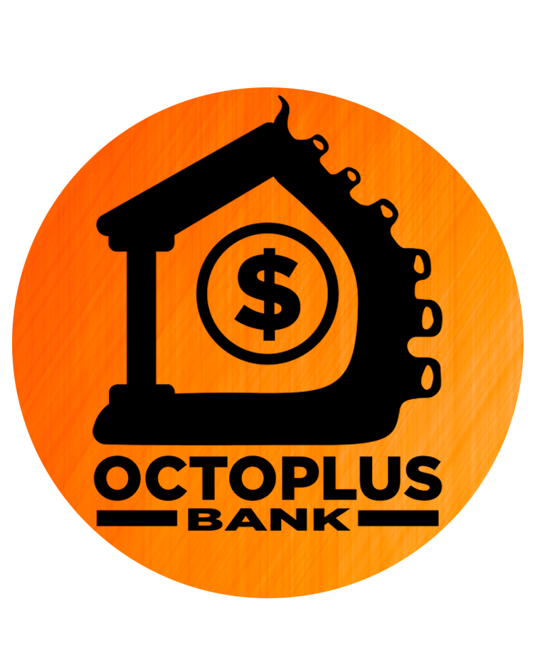
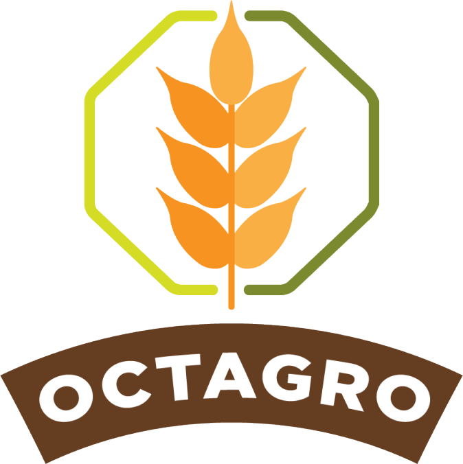

<h1>Portfólio das APIs - Jean Lucas de Faria Silva</h1>

Portfólio do terceiro semestre para a matéria de Gestão Ágil de Projetos de Software, lecionada pelo Professor Eduardo Sakaue.

<h2>Sumário</h2>

◻️ <a href="#sobre-mim">Sobre mim</a>

◻️ <a href="#meus-projetos">Meus Projetos</a>

<ul><a href="#octoplusbank">1º Semestre • 2/2022 • OctoplusBank </a>
  

    
Detalhes

    <ul>◻️ <a href="#tecnologias-utilizadas">Tecnologias Utilizadas</a></ul>
    <ul>◻️ <a href="#contribuições-pessoais">Contribuições Pessoais</a></ul>
    <ul>◻️ <a href="#lições-aprendidas">Lições Aprendidas</a>
    <ul>◻️ <a href="#hard-skills">Hard Skills</a></ul>
    <ul>◻️ <a href="#soft-skills">Soft Skills</a></ul>
    </ul>
  

</ul>

<ul><a href="#octagro">2º Semestre • 1/2023 • OctAgro </a>
  

    
Detalhes

    <ul>◻️ <a href="#tecnologias-utilizadas-">Tecnologias Utilizadas</a></ul>
    <ul>◻️ <a href="#contribuições-pessoais-">Contribuições Pessoais</a></ul>
    <ul>◻️ <a href="#lições-aprendidas-">Lições Aprendidas</a>
    <ul>◻️ <a href="#hard-skills-">Hard Skills</a></ul>
    <ul>◻️ <a href="#soft-skills-">Soft Skills</a></ul>
    </ul>
  

</ul>

<ul><a href="#ninetech">3º Semestre • 2/2023 • NineTech</a>
  

    
Detalhes

    <ul>◻️ <a href="#tecnologias-utilizadas--">Tecnologias Utilizadas</a></ul>
    <ul>◻️ <a href="#contribuições-pessoais--">Contribuições Pessoais</a></ul>
    <ul>◻️ <a href="#lições-aprendidas--">Lições Aprendidas</a>
    <ul>◻️ <a href="#hard-skills--">Hard Skills</a></ul>
    <ul>◻️ <a href="#soft-skills--">Soft Skills</a></ul>
    </ul>
  

</ul>

<h2>Sobre mim</h2>

Estou matriculado no terceiro semestre do curso de Desenvolvimento de Software Multiplataforma na FATEC de São José dos Campos. Atualmente, estou estagiando na MIDIASIM, onde aplico habilidades em PHP, MySQL e outras tecnologias para desenvolver e manter softwares personalizados para os clientes.

Interessado em aprender o máximo de áreas que envolvem a programação, almejando um dia me tornar um Desenvolvedor Full Stack.

<a href="https://www.linkedin.com/in/jeanlfs/">LinkedIn</a> • <a href="https://github.com/jeejinf">GitHub</a>

<h2>Meus Projetos</h2>
<h3 id="octoplusbank">OctoplusBank - Internet Banking</h3>
<h4>1º Semestre • 2/2022 • <a href="https://github.com/Octoplus-Group/OctoplusBank">Repositório Github e Documentação do Projeto</a></h4>

Parceiro Acadêmico: <a href="https://fatecsjc-prd.azurewebsites.net/">Faculdade de Tecnologia de São José dos Campos</a> (projeto interno)

</img>

O tema abordado neste projeto de API foi o desenvolvimento de um sistema para um Internet Banking; monitorando e controlando operações bancárias e reduzindo a necessidade de interações presenciais.

Utilizamos o modelo MVC para construir uma aplicação em Flask para resolver este problema proposto pelo nosso cliente, onde utilizamos os conhecimentos aprendidos durante as matérias do primeiro semestre, e também realizamos muita pesquisa extra classe para nos habituarmos nesse mundo novo da programação, neste projeto tínhamos um Gerente Geral, que podia criar agências e cadastrar novos Gerentes de Agência, e estes Gerentes de Agência eram os responsáveis por controlar os clientes de suas respectivas agências, já os clientes tinham a liberdade de realizar depósitos, saques, transferências e investimentos fictícios.

  
<b>Funcionalidades</b>

  <ul>
    <li>Gerente Geral: Pode gerenciar o capital total do banco, gerenciar gerentes de agência e criar agências.</li>
    <li>Gerente de Agência: Pode aprovar edições nas contas dos clientes, aprovar depósitos e gerenciar agências.</li>
    <li>Cliente: Pode criar uma conta, realizar depósitos, saques, transferências e deixar dinheiro rendendo.</li>
  </ul>

<h3 id="tecnologias-utilizadas">Tecnologias Utilizadas</h3>

<a href="https://www.figma.com/">Figma:</a> para o desenvolvimento e prototipação das wireframes.

<a href="https://www.w3.org/standards/">HTML, CSS e JS:</a> para o desenvolvimento da página web e estilização.

<a href="https://flask.palletsprojects.com/en/3.0.x/">Python e Flask:</a> para a construção da lógica e requisitos solicitados pelo nosso cliente.

<a href="https://www.mysql.com/">MySQL:</a> como SGBD do nosso projeto.

<a href="https://aws.amazon.com/pt/">AWS:</a> para colocar nosso projeto rodando em nuvem.

<h3 id="contribuições-pessoais">Contribuições Pessoais</h3>
<ul>
  <li>Prototipagem: junto com outros membros da equipe, realizamos a prototipagem, aprendendo na prática a utilizar o software <a href="https://www.figma.com/">Figma</a>.</li>
  <li>Criação das páginas, usando HTML, CSS (com Bootstrap) e JS (com JQuery): Nesse período, tive que aprender a utilizar HTML e CSS, e após construir boa base do site, fiz alguns ajustes, como máscara de CEP, CPF e Telefone, sendo que na máscara de CEP fiz a integração com uma API que consultava e inseria o endereço baseado no CEP registrado pelo usuário.</li>
  <li>Responsividade: como solicitado pelo cliente, fizemos a responsividade das páginas em que o usuário final teria acesso, refatorando boa parte do código para incluir o uso das colunas do Bootstrap, fazendo com que a nossa aplicação fosse responsiva para todos os tipos de dispotivos.</li>
</ul>
<h3 id="lições-aprendidas">Lições Aprendidas</h3>

Aprendi muitas tecnologias novas, metodologias novas, mas principalmente desenvolvemos Soft Skills necessárias para nos manter na faculdade, a comunicação em um projeto realizado durante meses é fundamental, e apesar do desafio de termos juntado um grupo onde ninguém sabia nenhuma tecnologia, e ninguém se conhecia, foi muito engradecedor para todos conseguir concluir esse projeto com um bom desempenho.

<h3 id="hard-skills">Hard Skills</h3>

  
<b>Clique para ver a lista de hard skills</b>

<table align="center">
  <tr>
    <th width="300px">Tecnologia/Metodologia</th>
    <th width="300px">Classificação</th>
  </tr>
  <tr>
    <td>Figma</td>
    <td>★★★★★★★☆☆☆</td>
  </tr>
  <tr>
    <td>HTML</td>
    <td>★★★★★★★★★☆</td>
  </tr>
  <tr>
    <td>CSS e Bootstrap</td>
    <td>★★★★★★★★★☆</td>
  </tr>
  <tr>
    <td>JavaScript</td>
    <td>★★★★★★★☆☆☆</td>
  </tr>
  <tr>
    <td>Python e Flask</td>
    <td>★★★★★★★★☆☆</td>
  </tr>
  <tr>
    <td>MySQL</td>
    <td>★★★★★★★★☆☆</td>
  </tr>
</table>

<h3 id="soft-skills">Soft Skills</h3>

<b>Clique para ver a lista de soft skills</b>

  <table align="center">
    <tr>
      <th width="300px">Habilidade</th>
      <th width="300px">Classificação</th>
    </tr>
    <tr>
      <td>Proatividade</td>
      <td>★★★★★★★★☆☆</td>
    </tr>
    <tr>
      <td>Visão de Negócio</td>
      <td>★★★★★★★☆☆☆</td>
    </tr>
    <tr>
      <td>Comunicação Assertiva</td>
      <td>★★★★★★★☆☆☆</td>
    </tr>
    <tr>
      <td>Empatia</td>
      <td>★★★★★★★☆☆☆</td>
    </tr>
    <tr>
      <td>Inteligência Emocional</td>
      <td>★★★★★★★☆☆☆</td>
    </tr>
    <tr>
      <td>Organização e Planejamento</td>
      <td>★★★★★★★☆☆☆</td>
    </tr>
    <tr>
      <td>Resiliência</td>
      <td>★★★★★★★★★☆</td>
    </tr>
  </table>

<b>Proatividade: </b>Estava no inicio da faculdade, bem animado e com quase nenhum conhecimento sobre as tecnologias e metodologias que me cercavam, mas com bastante vontade de aprender, acredito que foi o Semestre até então que mais me desempenhei para conseguir comunicar melhor com meus colegas, e fui bem propositivo para conseguirmos entregar um bom MVP, apesar da dificuldade de não ter experiência com o método SCRUM, nós conseguimos nos virar bem durante as 4 sprints.

<a href="#sumário">Voltar para o início</a>

<h3 id="octagro">OctAgro - ERP de Inspeção de entrada para controle de recebimento de grãos.</h3>
<h4>2º Semestre • 1/2023 • <a href="https://github.com/OctAgro/OctAgro-API">Repositório Github e Documentação do Projeto</a></h4>

Parceiro Acadêmico: <a href="https://www.jaia.software/">Jaia Software</a>

</img>

O tema abordado neste projeto de API foi o desenvolvimento de um sistema para facilitar e padronizar a entrada de grãos em um estoque fictício.

No nosso sistema existia um Recebedor, que era responsável pela entrada desse grão, um Analista, que verificava se as documentações e averiguações haviam sido realizadas corretamente, um Aprovador que finalizava essa entrada, e um Administrador, que poderia realizar todas as acões anteriores e também poderia criar novos usuários para o ERP.

Para esse sistema, utilizamos a MERN STACK (um conjunto de ferramentas que trabalham bem em um conjunto e são bem estabelecidas no mercado, e elas eram: MySQL, Express, React e Node e a arquitetura de MVC.

  
<b>Funcionalidades</b>

  <ul>
    <li>Recebedor: Podia aceitar a entrada da mercadoria, analisando informações como: NF, Placa do Caminhao, Nome do Caminhoneiro, Produto e Quantidade.</li>
    <li>Analista: Verificava a qualidade desse grão, e outros critérios previamente estabelecidos pelo Administrador desse sistema, como: Umidade, Quantidade de Insetos e Coloração.</li>
    <li>Aprovador: Confirmava se os dados informados pelos colaboradores anteriores estavam corretos, caso positivo, era realizada a entrada desse produto no estoque.</li>
    <li>Administrador: O Administrador poderia realizar qualquer uma das 3 funções anteriores, e também poderia cadastrar, atualizar e remover novos usuários no nosso sistema.</li>
  </ul>

<h3 id="tecnologias-utilizadas-">Tecnologias Utilizadas</h3>

<a href="https://www.figma.com/">Figma:</a> para o desenvolvimento e prototipação das wireframes.

<a href="https://react.dev/">React e Module CSS:</a> para o desenvolvimento da página web e estilização.

<a href="https://nodejs.org/en">JavaScript, Node e Express:</a> para a construção da lógica e requisitos solicitados pelo nosso cliente.

<a href="https://www.mysql.com/">MySQL:</a> como SGBD do nosso projeto.

<h3 id="contribuições-pessoais-">Contribuições Pessoais</h3>
<ul>
  <li>Realizei em conjunto com o meu colega Thiago Zani o desenvolvimento do protótipo desse projeto, que após aprovado pelo cliente na primeira semana, não houve alteração em nenhuma das 4 sprints.</li>
  <li>Construi boa parte do sistema do Aprovador e Recebedor, e realizei alterações no na lógica do BackEnd quando necessário.</li>
  <li>Colaborei para o ritmo do time.</li>
</ul>
<h3 id="lições-aprendidas-">Lições Aprendidas</h3>

Nesse semestre consolidei vários aprendizados, principalmente relacionadas à metodologia ágil, mas ainda tivemos alguns problemas com o Dev Team, principalmente por falta de Dailys, tivemos uma certa dificuldade no começo por ainda estar aprendendo o fluxo de trabalho e tive que estudar várias horas de React para ter um conhecimento considerável da ferramenta. Também foi o nosso primeiro contato com uma empresa externa, e esse feedback de uma empresa especializada neste tipo de produto foi de extrema importância para mudar a nossa forma de ver a entrega de um sistema.

<h3 id="hard-skills-">Hard Skills</h3>

  
<b>Clique para ver a lista de hard skills</b>

  <table align="center">
    <tr>
      <th width="300px">Tecnologia/Metodologia</th>
      <th width="300px">Classificação</th>
    </tr>
    <tr>
      <td>Figma</td>
      <td>★★★★★★★★☆☆</td>
    </tr>
    <tr>
      <td>React</td>
      <td>★★★★★★★★★☆</td>
    </tr>
    <tr>
      <td>JavaScript, Node e Express</td>
      <td>★★★★★★★☆☆☆</td>
    </tr>
    <tr>
      <td>MySQL</td>
      <td>★★★★★★★☆☆☆</td>
    </tr>
  </table>

<h3 id="soft-skills-">Soft Skills</h3>

<b>Clique para ver a lista de soft skills</b>

  <table align="center">
    <tr>
      <th width="300px">Habilidade</th>
      <th width="300px">Classificação</th>
    </tr>
    <tr>
      <td>Proatividade</td>
      <td>★★★★★★★★★☆</td>
    </tr>
    <tr>
      <td>Visão de Negócio</td>
      <td>★★★★★★★★★☆</td>
    </tr>
    <tr>
      <td>Comunicação Assertiva</td>
      <td>★★★★★★★★☆☆</td>
    </tr>
    <tr>
      <td>Empatia</td>
      <td>★★★★★★★☆☆☆</td>
    </tr>
    <tr>
      <td>Inteligência Emocional</td>
      <td>★★★★★★★★☆☆</td>
    </tr>
    <tr>
      <td>Organização e Planejamento</td>
      <td>★★★★★★☆☆☆☆</td>
    </tr>
    <tr>
      <td>Resiliência</td>
      <td>★★★★★★★★☆☆</td>
    </tr>
  </table>

Nesse semestre, a <b>visão de negócio</b> em conjunto com a <b>proatividade</b> nos levou a alcançar um resultado bem interessante, onde podíamos ver que o trabalho realizado no primeiro semestre havia nos ensinado bastante, mas ainda tínhamos muito o que aprender, principalmente ao lidar com a organização de pessoas, tivemos um projeto bem mais sólido e conseguimos aprender um conjunto de ferramentas bem variadas e cumprimos com todos os prazos estabelecidos pelo cliente.

<a href="#sumário">Voltar para o início</a>

<h3 id="ninetech">NineTech</h3>
<h4>3º Semestre • 1/2023 • <a href="https://github.com/Nine-Tech/nine-tech-documentation">Repositório Github e Documentação do Projeto</a></h4>

Parceiro Acadêmico: <a href="https://www.siatt.com.br/siatt/">Siatt</a>

</img>

Nossa parceira, a empresa Siatt, enfrenta o desafio de gerenciar eficazmente seus projetos estratégicos em um cenário de complexidade, apresentamos uma solução abrangente e flexível, um Sistema de Gerenciamento de Times para Projetos Complexos. Esse sistema foi projetado para atender às necessidades específicas da Siatt, permitindo tanto um macro gerenciamento quanto um micro gerenciamento dos projetos.

  
<b>Funcionalidades</b>

    <ul>
      <li>Engenheiro Chefe: Era da competência do Engenheiro Chefe, importar projetos antigos em formato de .xlsx para o nosso Sistema, e seria automaticamente integrado no nosso banco de dados todas as informações daquele projeto, podendo ser atribuído esse projeto a um Lider de Projeto.</li>
      <li>Lider de Projeto: É o responsável para dizer como está o andamento do Projeto, e também pode ver informações importantes como o Gráfico de Curva S, qual o prazo da entrega e os custos que envolvem cada parte desse projeto.</li>
    </ul>

<h3 id="tecnologias-utilizadas--">Tecnologias Utilizadas</h3>

<a href="https://www.figma.com/">Figma:</a> para o desenvolvimento e prototipação das wireframes.

<a href="https://react.dev/">React e Sass:</a> para o desenvolvimento da página web e estilização.

<a href="https://nodejs.org/en">Java, com Spring Boot:</a> para a construção da lógica e requisitos solicitados pelo nosso cliente.

<a href="https://www.mysql.com/">MySQL:</a> como SGBD do nosso projeto.

<h3 id="contribuições-pessoais--">Contribuições Pessoais</h3>
<ul>
  <li>Estruturação da lógica no Back End para a parte de Cronograma Estimado, que é necessario para os gráficos.</li>
  <li>Colaborei com a Refatoração do BackEnd no meio do projeto por mudanças de requisitos</li>
  <li>Criação do Front End do CRUD de Usuários.</li>
</ul>
<h3 id="lições-aprendidas--">Lições Aprendidas</h3>

Aprendemos no geral que temos um grande poder de negociação com o cliente, podendo negociar prazos e requisitos, também tivemos um grande número de participantes em nossa equipe que acabaram saindo no meio do projeto, nos acrescentando a experiência de lidar com varios tipos de personalidades, e também conseguimos delegar melhor as funções, para que, apesar de alguns membros terem feito bem mais coisas que outros, no geral foi melhor balanceado essa divisão de tarefas.

<h3 id="hard-skills--">Hard Skills</h3>

  
<b>Clique para ver a lista de hard skills</b>

  <table align="center">
    <tr>
      <th width="300px">Tecnologia/Metodologia</th>
      <th width="300px">Classificação</th>
    </tr>
    <tr>
      <td>Figma</td>
      <td>★★★★★★★☆☆☆</td>
    </tr>
    <tr>
      <td>React</td>
      <td>★★★★★★★★☆☆</td>
    </tr>
    <tr>
      <td>Java e Spring Boot</td>
      <td>★★★★★★★★☆☆</td>
    </tr>
    <tr>
      <td>MySQL</td>
      <td>★★★★★★★★★☆</td>
    </tr>
  </table>

<h3 id="soft-skills--">Soft Skills</h3>

<b>Clique para ver a lista de soft skills</b>

  <table align="center">
    <tr>
      <th width="300px">Habilidade</th>
      <th width="300px">Classificação</th>
    </tr>
    <tr>
      <td>Proatividade</td>
      <td>★★★★★☆☆☆☆☆</td>
    </tr>
    <tr>
      <td>Visão de Negócio</td>
      <td>★★★★★★★☆☆☆</td>
    </tr>
    <tr>
      <td>Comunicação Assertiva</td>
      <td>★★★★★★★★☆☆</td>
    </tr>
    <tr>
      <td>Empatia</td>
      <td>★★★★★★★★☆☆</td>
    </tr>
    <tr>
      <td>Inteligência Emocional</td>
      <td>★★★★★★★☆☆☆</td>
    </tr>
    <tr>
      <td>Organização e Planejamento</td>
      <td>★★★★★★★☆☆☆</td>
    </tr>
    <tr>
      <td>Resiliência</td>
      <td>★★★★★★★★☆☆</td>
    </tr>
  </table>

<b>Inteligência Emocional: </b>conseguimos terminar o projeto um pouco antes do previsto, mesmo sendo um projeto bem complexo, pelos detalhes que eram requisitados, no geral tivemos uma boa comunicação na equipe, e testamos novos métodos de auto gerenciamento, foi um semestre onde a parte da Soft Skill foi mais essencial que as tecnologias.

<a href="#sumário">Voltar para o início</a>

